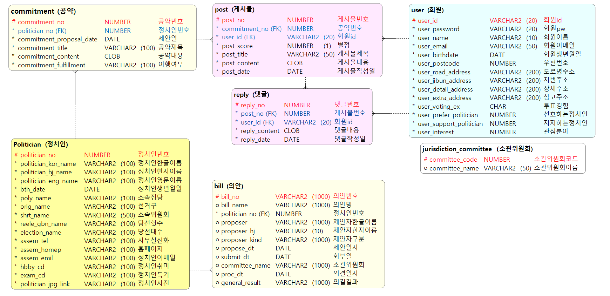

# Project jcjc
공공데이터의 국회의원 및 의안 정보 API 를 활용하여  
각 지역구별 정치인의 의정활동 정보와 공약 평가 서비스를 제공  
  
  
   

# 서비스 개요
### 1) 개발 동기
 - __높아지는 투표율, 높아지는 정치 참여__  
  국회의원은 입법부이며 국민의 대표 기관인 국회의 구성원으로, 국민을 대표하여 법률을 제정하고 국정을 심의한다. 국민의 이익을 대변하는 직업인만큼 대한민국 유권자의 관심도 뜨겁다. 지난 ‘제20대 국회의원 선거(제20대 총선)’의 투표율은 58.0%로 제18대(46.1%), 제19대(54.2%)를 이어 고공 행진을 이어가고 있다. 특히 젊은 층에서 투표율 상승이 두드러졌는데, 이번 제20대 총선의 투표율 견인에 가장 큰 공을 세운 집단 또한 20대였다. 지상파 3사에서 진행한 출구조사 결과, 20대의 투표율은 지난 19대에 비해 13%p오른 49.4%로 집계되며 모든 연령대를 통틀어 가장 높은 상승률을 기록했다. 이는 젊은 층의 정치참여도 증가의 청신호이며, 건강한 정치문화를 만들어가기 위한 좋은 지표이다.
  
- __높아지는 정치 불신, 낮아지는 정치 관심__  
  문제는 젊은 층이 가지고 있는 정치인에 대한 불신이다. ‘지속가능바람 대학생 기자단’과 ‘한국CSR연구소’가 공동으로 ‘현대리서치’에 의뢰해 조사한 ‘2018 대한민국 대학생 신뢰지수’에 따르면, ‘정치인’은 7점 만점 중 2.27점으로 조사 대상 집단 22개에서 가장 낮았다. 응답자에 의하면, 대한민국 전체에 큰 영향을 미치는 정치인이 국민의 기대에 부응하지 않는 모습을 보인 것에 큰 실망을 느낀 사람이 많았고, 이로 인해 낮은 신뢰도라는 결과가 나타났다는 것이다. 그러나 이러한 근거가 설득력이 없는 가장 큰 이유는 정치인에 대한 국민들의 관심과 정보의 부족이다. ‘Project 정치정치’에서 자체 진행한 설문조사 결과에 따르면, 응답자가 살고 있는 지역구 국회의원을 모르고 있는 응답자가 74.2%로 나타났으며, 지역구 국회의원의 공약을 모르고 있다고 응답한 응답자의 비율이 62.1%로 나타났다. 이를 통해 정치인에 대해 관심과 정보가 부족하다는 것을 알 수 있다. 또한, 20대 국회에 접수된 의안의 총 건수를 물어보는 문항에 응답자 평균이 약 700건으로 나타났다. 20대 국회에만 접수된 의안의 개수가 약 2만 건이라는 사실에 비춰봤을 때, 정치인의 의정활동에 대한 국민들의 평가가 실제와는 다르게 부정적이라는 것을 알 수 있다.
  
- __제21대 총선 투표의 판단근거를 제공하는 ‘Project정치정치’__  
  정치인은 국민의 이익을 위한 직업인만큼 유권자가 행사한 한 표는 곧 국민의 삶의 질과 큰 관련이 있다. 영국의 총리이자 정치가인 ‘윈스터 처칠’은 ‘모든 나라는 그 나라 국민 수준에 맞는 지도자를 갖는다.’고 말했다. 투표율이 꾸준히 올라가고 20·30대 정치 참여도가 증가하는 만큼 내가 지지하는 정치인이 어떤 사람이고, 어떤 정치적 견해를 가지고 있으며, 어떤 의정활동을 해왔는지에 대한 관심과 정보가 필요하다. 이렇게 얻은 관심과 정보를 기반으로 유권자들이 제21대 총선 투표를 하는 것, 이것이 ‘Project 정치정치’를 개발하게 된 동기이다.  
  
     
  
### 2) 목적 및 목표
  - ‘Project 정치정치’는 ‘유권자에게 정치인 관련 정보를 신속, 정확하게 제공하여 정치인에 대한 관심을 높이고,  
  다가오는 제21대 총선에 특정 정치인을 지지할 수 있는 판단근거 제공’이라는 목적을 이루기 위한 목표는 다음과 같다.
    - 제20대 총선 지역구 지도 구현(당선자 Profile 제공)
    - 국회의원 공약이행 현황 정보 제공
    - 국회의원 SNS 팔로워 수치를 나타내는 daily 차트 제공
    - 국회의원 이름이 헤드라인에 노출된 언론기사 본문 형태소 분석 후 워드 클라우드 제공
    - 제20대 국회 발의의안 DB 구축 및 국회의원별 제출의안 정보 제공
    - 국회의원의 발의의안 소관위 분석을 통한 관심 분야 정보 제공
    - 국회의원간 비교분석 정보(공약 이행률, 워드 클라우드, 발의의안 개수, 관심 분야 정보) 제공  
    
   
  
### 3) 기대효과
- ‘Project 정치정치’는 산재해 있는 정치인 정보 중 유권자가 원하는 특정 정보를 쉽고 빠르게 얻을 수 있도록 하여 21대 총선 투표 시 지지하는 정치인에게 투표할 수 있는 판단 근거를 제공, 유권자의 삶의 질 향상에 이바지한다.  

    - __공약 평가__  
      ‘Project 정치정치’에서는 정치인이 내건 공약 정보를 보여주는 것은 물론, 사용자가 공약에 대해 평가할 수 있는 서비스를 제공한다. 공약 평가 서비스를 통해 유권자는 해당 공약에 대한 의견을 다른 사용자와 나누고, 평가할 수 있다.

    - __의정활동 상세__  
      ‘Project 정치정치’에서는 정치인이 20대 총선에서 발의한 모든 의안을 보여준다. 단순히 정치인이 발의한 의안을 보여주는 것이 아니라 발의한 의안이 본회의를 통과됐는지, 계류 중이라면 진행상황에 대한 정보를 함께 제공함으로써, 해당 국회에서 정치인이 얼마나 적극적으로 의정활동을 수행했는지를 판가름할 수 있는 지표를 제공한다.

    - __활동성 지수__  
      'Project 정치정치’에서는 정치인이 발의한 법안의 소관위 별 빈도분석, 해당 정치인이 어떤 분야에 전문성이 있고, 관심이 있는지를 알 수 있다.

    - __후보자 비교__  
      'Project 정치정치’에서는 비교해보고 싶은 후보자를 선택하여 공약이행률, 활동성 지수, 관심 분야, 관계도 형태소 분석 결과 등을 다각도로 비교하여 후보자별 특장점을 한눈에 볼 수 있도록 비교분석 서비스를 제공한다.  
      
      
    
  
# 프로젝트 수행
### 1) 팀 구성 및 역할분담
  | 이름 | 역할 |    |
  | :------- | :----------- | :------- |  
  | 오승룡 | 회원가입, 의정활동 평가 |  Spring, Oracle, Mybatis  |  
  | 윤나래 | 회원가입, 공약 평가 게시판 |  Spring,  Oracle, Mybatis  |  
  | 임덕현 | DB 설계, 지도 API |  Oracle  |  
  | 박수연 | DB 설계, DAO 구현 |  Oracle, MyBatis  ||  
  
 
  
### 2) 일정
  2019년 3월 26일 ~ 2019년 4월 23일  
  [>> 일정](https://github.com/LydiaYoon/jcjc/blob/master/image/jcjc_schedule.png)
  
 
  
### 3) 시스템 구현  
|  |  |
| :------------ | :----------- |   
| Development Environment | Windows 10 |  
| IDE | Eclipse Jee 2018-09 | 
| Front-end | HTML5, CSS3, JavaScript, jQuery, Bootstrap |  
| Back-end | Java 1.8, Python 3.7, Spring Framework 4.0 |  
| WAS | tomcat 8.5 |  
| DB | Oracle 10g |  
| Documentation | Google Docs, Object AID, DA# Modeler5 ||  
  
    
# 설계  
### 1) DB Diagram  
  
  
     
  
### 2) Class Diagram  
  [>> 클래스 다이어그램](https://github.com/LydiaYoon/jcjc/tree/master/image/class_diagram)
  
     
  
### 3) 실행 화면  
    
  
